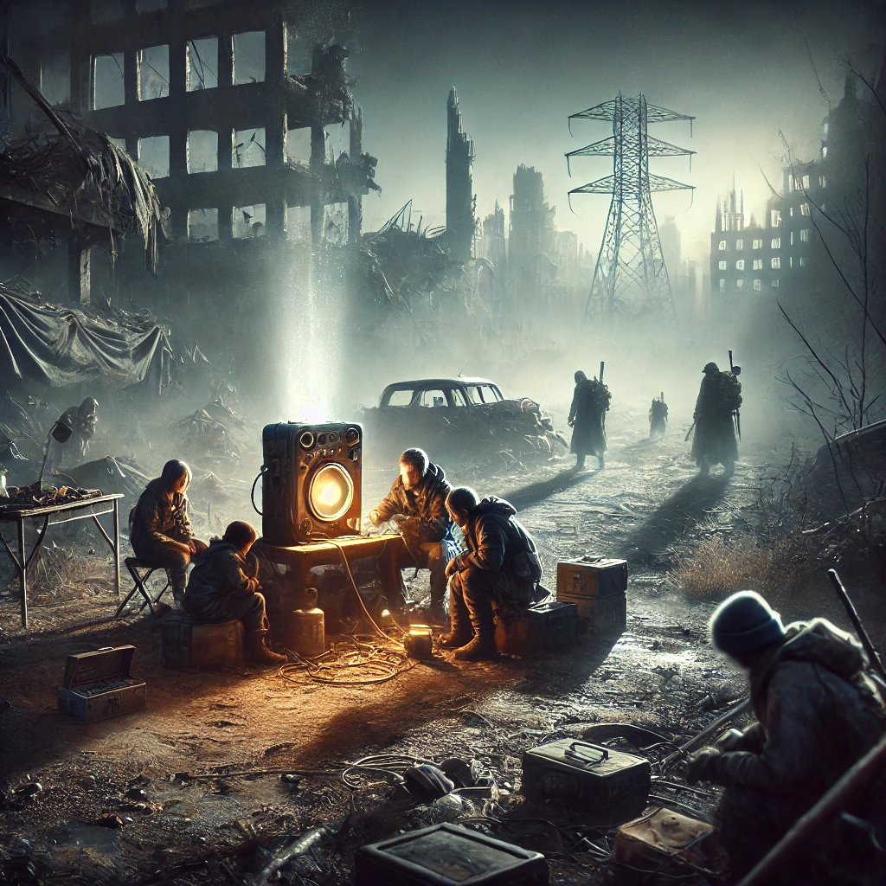

# Laboratory: Embedded Connector Design in C

## Chapter 1: Communications

In a post-apocalyptic world, where much of human civilization has been wiped out, communication between the scattered groups of survivors is vital. It is essential for coordinating scarce resources, defending against relentless threats, and keeping alive the fragile hope of rebuilding society.

Unfortunately, the harsh conditions have taken a toll on existing communication devices, rendering old methods unreliable. The need has arisen for a new kind of embedded connector, one that can facilitate secure and efficient communication in this hostile environment with limited resources.

Early on, we made significant progress on this project in collaboration with another team. Tragically, they are no longer with us, having fallen to the unforgiving world outside. Their loss is a stark reminder of the dangers we face, and their contribution to this endeavor cannot be forgotten.

Now, it falls to you. We entrust you with the task of designing a functional prototype of this embedded connector. It must be capable of handling various types of messages, securely logging communications, and applying essential security measures to protect the information that may be the key to our survival.

  

## Objectives

- Apply key C programming concepts, including pointers, structs, function pointers, and file operations.
- Design a robust and efficient solution for the problem at hand.
- Demonstrate good coding practices in C.

## Competencies

- **Design**: Students must be able to design a solution that meets the requirements and constraints.
- **Coding**: Proper use of pointers, structs, function pointers, and file operations.
- **Code Style**: Adherence to good coding practices, including meaningful variable names, comments, and modular code. Also code should be formatted using `Microsoft` style with `clang-format` and documented using `Doxygen`

## Requirements

1. **Communication Protocol Design**:

   - The communication protocol defines how devices interact with each other in the post-apocalyptic scenario. The protocol is simple yet flexible enough to handle different types of messages. It uses a `struct` to define the message format, pointers for dynamic data manipulation, function pointers to handle various message types, and preprocessor directives for flexibility and configurability. Bitwise operators are included to efficiently handle flags and control bits in the protocol.

2. **File Operations**:

   - Implement logging functionality that records every message sent and received. Use file operations to store these logs.

3. **Security Consideration (Optional)**:
   - Implement a basic security feature to encrypt/decrypt messages using simple algorithms.

## Deliverables

- **Code**: Well-documented C codebase demonstrating the use of pointers, structs, function pointers, and file operations.
- **Design Document**: A short report using a issue or PR summary, describing the design choices (This include diagrams in Mermaid), including the protocol and security features.

## Assessment Criteria

- **Functionality**: Does the solution meet the objectives? (30%)
- **Design**: Is the solution well-designed and does it follow good software engineering practices? (30%)
- **Code Style**: Is the code well-organized, readable, and properly commented? (10%)
- **Teamwork**: How well did the team collaborate and divide tasks? (30%)

## Timeline

- **ETA determined on Discord**
